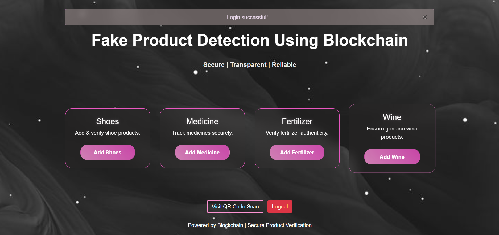
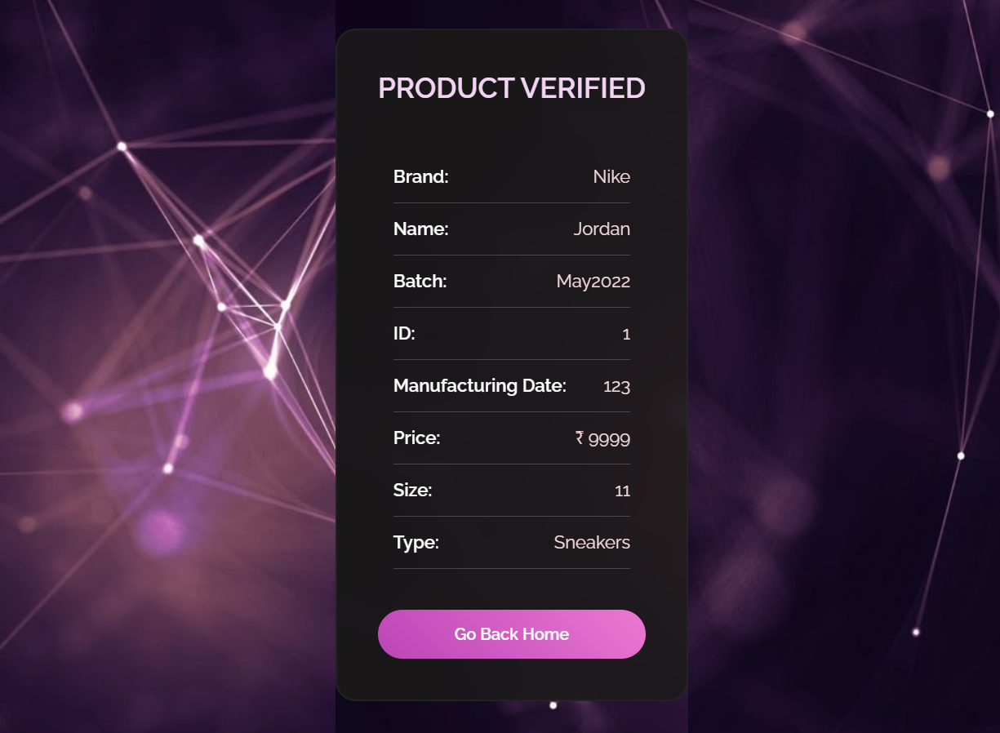
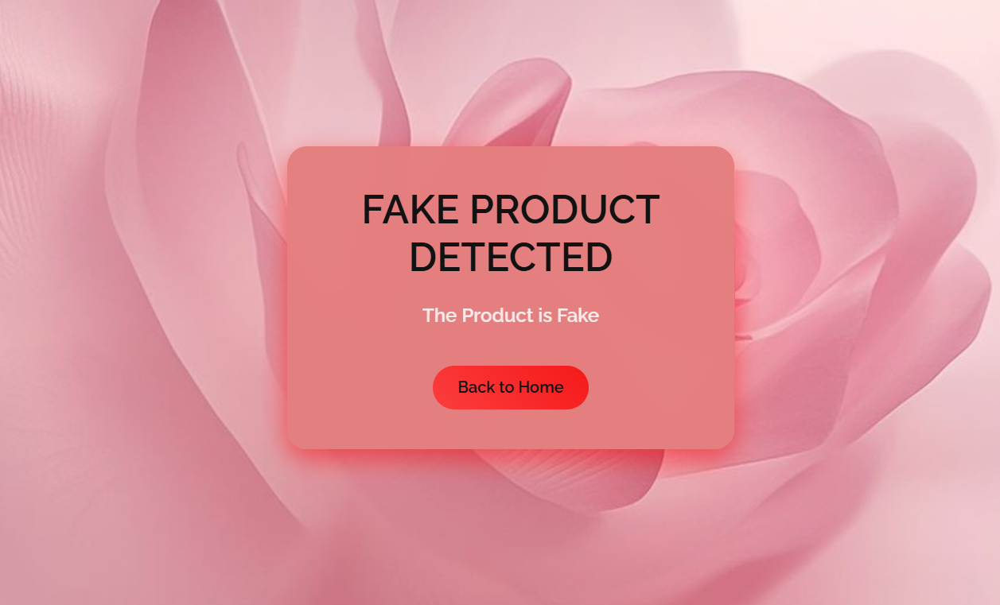

# FAKE PRODUCT DETECTION USING BLOCKCHAIN TECHNOLOGY

Fake products are a huge problem today — from medicines to cosmetics, agricultural goods, and even beverages. This project is my attempt to solve that problem using blockchain technology for secure product registration and QR code scanning for verification.

# What this project does

1. Allows manufacturers to register products securely.

2. Generates a unique QR code for each product.

3. Fake Product Detection – verifies authenticity of products.

4. Customers can scan the QR code to check whether a product is genuine or fake.

5. Stores product data in a tamper-proof blockchain structure.

# Tech Stack

Python (Flask) – for backend and routing

HTML, CSS, Bootstrap – for frontend pages

Blockchain Simulation (Custom Python class) – for secure product records

qrcode + PIL – to generate product QR codes
  

# Features

Index Page → Access User Registration and Admin Login

Register Page → New users sign up.

Login Page → Secure login for users.

Product Forms → Add Shoes, Medicine, Fertilizer, Wine.

Verification Page → Scan QR → See details → Confirm if genuine or fake.

# Screenshots

# Index Page

# Register Page  
  

# Login Page  
  

# Home Page

# Product Form  
  

# Verified Product  

# Fake Product

